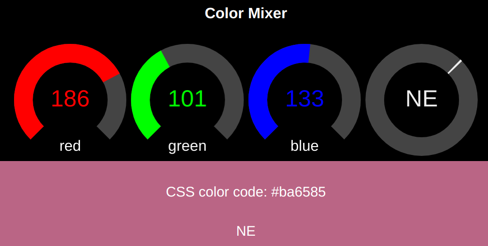

# vue-canvas-knob

Looking for a minimalistic styled, lean, but versatile gauge and knob control, I found my favorite with Andre Plötze's PureKnob package (https://github.com/andrepxx/pure-knob). Andre created that widget in pure JS, so it can be used for any app without dependening of any framework or library - just based on the HTML DOM and canvas.

As a fan of the lean and mean [Vue web framework](https://vuejs.org/) and a more declarative programming model I preferred using that widget as Vue component and used Andre's code creating a Vue component. The original package also contains linear bar graphs that I didn't port. As the original *vue-canvas-knob* supports mouse, wheel, touch and  keyboard control. Besides Vue, HTML5 and ES6 JS no dependencies are needed.

## Example (Vue Cli project)

The package's root folder contains a small *color mixer* webapp containing three *vue-canvas-knob* widgets that are used to mix the color of a box beneath. Right of it is a multiswitch knob with eight compass directions in *needle*-style.

> Here *vue-canvas-knob* is used as Vue single file component (SFC), which cannot be used in browsers directly. The continous integration tool [Vue Cli](https://cli.vuejs.org/) precompiles anything (HTML, JS, CSS) into massively packed JS-files for optimal performance, low footprint, encapsulation and browser version independence. Using this is the recommended approach.
If you need to use *vue-canvas-knob* in some legacy project that doesn't allow precompiled code, you can may the component form file "legacy/vue-knob.js" with a HTML conventional *\<script\>* tag (See next example).



```vue
<template>
  <div id="app">
    <h1>Color Mixer</h1>
    <!-- knobs to control RGB value -->
    <vue-knob :width=knobSize :height=knobSize color-bg="#444444" :value-min="0" :value-max="255"
               color-fg="#ff0000" label="red" value="127" @value-changed="colorChanged('r', $event)"/>
    <vue-knob :width=knobSize :height=knobSize color-bg="#444444" :value-min="0" :value-max="255"
              color-fg="#00ff00" label="green" value="127" @value-changed="colorChanged('g', $event)"/>
    <vue-knob :width=knobSize :height=knobSize color-bg="#444444" :value-min="0" :value-max="255"
              color-fg="#0000ff" label="blue" value="127" @value-changed="colorChanged('b', $event)"/>

    <!-- hat switch with compass directions with needle style -->
    <vue-knob :width=knobSize :height="knobSize" color-bg="#444444" :value-min="0" :value-max="8"
              :angle-start="-Math.PI" :angle-end="Math.PI" color-fg="#eeeeee"
              value="4" :needle="true" :string-to-value="directionToValue" :value-to-string="valueToDirection"
              @value-changed="directionChanged($event)">

    </vue-knob>
    <div id="resultPane" :style="{backgroundColor: getBackgroundColor}">
      <p class="text">CSS color code: {{getBackgroundColor}}</p>
      <p class="text">{{valueToDirection(direction)}}</p>
    </div>
  </div>
</template>

<script>
import VueKnob from "@/components/vue-knob";

// compass directions
const directions = ['S','SW','W','NW','N','NE','E','SE'];

export default {
  name: 'App',
  components: {
    VueKnob
  },

  data: function() {
    return {
      knobSize: 250,
      direction: 'N',
      r: 127,
      g: 127,
      b: 127
    }
  },

  computed: {
    getBackgroundColor() {
      return '#'+ this.to2hex(this.r) + this.to2hex(this.g) + this.to2hex(this.b);
    }
  },

  methods: {
    colorChanged(color, e)  {
      this[color] = e;
    },

    directionChanged(e) {
      this.direction = e;
    },

    to2hex(n) {
      let s = n.toString(16);
      if (s.length < 2) s= '0'+s;
      return s;
    },

    // convert compass direction to internal number
    directionToValue(direction) {
      const idx = directions.findIndex(el => el === direction.toUpperCase());
      return (idx === -1) ? 0 : idx;
    },

    // convert internal number to compass direction
    valueToDirection(value) {
      return directions[Math.trunc(value % 8)];
    }
  }
}
</script>

<style>
#app {
  font-family: Avenir, Helvetica, Arial, sans-serif;
  -webkit-font-smoothing: antialiased;
  -moz-osx-font-smoothing: grayscale;
  text-align: center;
  color: #2c3e50;
  margin-top: 60px;
  background-color: black;
}

#resultPane {
  left: 0;
  right: 400px;
  top: 0;
  height: 200px;
  padding: 10px;
  border: 1px solid black;
}

h1 {
  padding: 20px;
  color: white;
}

.text {
  padding: 10px;
  font-size: 30px;
  color: white;
}
</style>
```

The file *App.vue* contains the application*s code, all other files were scaffolded by the [Vue Cli](https://cli.vuejs.org/), and remain unchanged. The component lays in the *components* folder.

## Example (Vue Legacy JS project)
If you want to use *vue-canvas* knob in some legacy JS project where you can't use [Webpack](https://webpack.js.org/) and its compiler plugins, you can use the file *vue-knob.js* stored in the *legacy* folder instead. There is also an *index.html* file containing the *Color-Mixer* example with the same functionality as the preferred code above in that folder. Of course it will have drawbacks related to performance, size and possible side effects wit existing code, which were solved by implementation of single file component integrating projects.


## Knob Operation

- Normal left click / drag / touch changes value, releasing button commits value.
- pulling mouse / touch outside the element before release restores back to old value.
- double click or middle click enables entry of value via keyboard.
- when input field is enabled `ESC` to restore old value and disable keyboard entry, `Enter`/`Return` to commit new value and disable keyboard entry.
- disable input field by clicking outside of it or pressing ESC key 
- use mouse wheel to turn knob

## Installation and usage
Download the whole demo app from [GitHub](https://github.com/ambotaku/vue-knob) or just use *npm* or *yarn* to install *vue-canvas-knob* in your own NodeJS project:
```
$ npm install vue-canvas-knob
```
To import *vue-canvas-knob* widgets you may use ...
```
import VueKnob from "@/components/vue-knob";
```
... like in my example above. That import will allow using the <vue-knob> tag in your templates:
```html
    <vue-knob :width=knobSize :height=knobSize colorBg="#444444" :value-min="0" :value-max="255"
              color-fg="#ff0000" label="red" :value="127" @value-changed="colorChanged('r', $event)"/>
```
As attributes all properties explained below can be passed and support Vue's data binding, e.g. the variable *knobSize* that is bound to the height and width attributes (The colon before the attribute is needed for passing numbers in Vue). Currently *vue-canvas-knob* only supports a *value-changed* event that is passing a value when the knob gets turned (All event names are prefixed with @ for Vue, $event contains that value, extra parameters can be used e.g. to identify an instance).

## Developer support
I recommend using VueCli, since it allows round-trip-engineering and automates anything from scaffolding applications up to building and testing. Via *package.json* the following console commands are supported:

#### Build application
```
$ yarn build
```
#### serve application in a test server
```
$ yarn serve
```
#### static analysis / test application code
```
$ yarn lint
```

## Properties

- `width`: widget width `300px`
- `height`: widget height `300xp`
- `angleStart`: Angle in radians, at which the knob track starts `-0.75 * Math.PI`
- `angleEnd`: Angle in radians, at which the knob track ends. `+0.75 * Math.PI`
- `angleOffset`: Offset in radians, relative to the positive x-axis. `-0.5 * Math.PI`
- `colorBg`: Color of the knob track. `#181818`
- `colorFg`: Color of the knob gauge / indicator.  `#ff8800`
- `colorLabel`: Color of the (optional) label. `#ffffff`
- `stringToValue`: Function turning a string into a (numeric) value. `(value) => parseInt(value)`
- `valueToString`: Function turning a (numeric) value into a string.  `(value) => value.toString()`
- `inputPopup`: enable input popup field; only usable for numeric values (don't user for multiswitchs) `false`
- `label`: A label (string) displayed at the bottom of the knob, a track radius length away from the center. Set to null to not print any label. `null`
- `needle`: Boolean indicating whether we should use a tiny marker / needle instead of a filling gauge to indicate value along the knob's track. `false`
- `readOnly`: Boolean indicating whether the value of the knob is write-protected and thus not editable by the user. Useful for displaying values (gauges) without allowing them to get edited. `false`
- `textScale`: Linear scaling factor for increasing / decreasing the font size. `1.0`
- `trackWidth`: Width of the track, relative to the average radius of the knob. `0.4`
- `valueMin`: Minimum selectable value. `0`
- `vallueMax`: Maximum selectable value. `100`
- `value`: iniitial value `0`

All properties have defaults (shown in red after the explanation above).

## Events
-  colorChanged will be called for a committed value change and passes that value to a handler as sole parameter. For passing additional values assign a function that gets the value as parameter $event (like in example above).

## Node Red
The included file *nodered-uibuilder-vue.json* is a demo for using *vue-knob* widgets in node-red frontends using the uibuilder node. For more information see [node-red UI Builder](https://flows.nodered.org/node/node-red-contrib-uibuilder)
